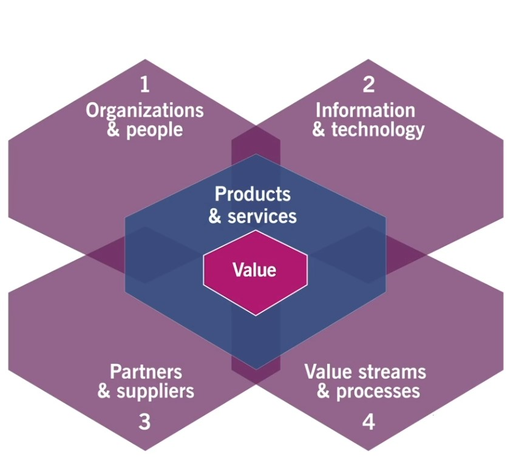
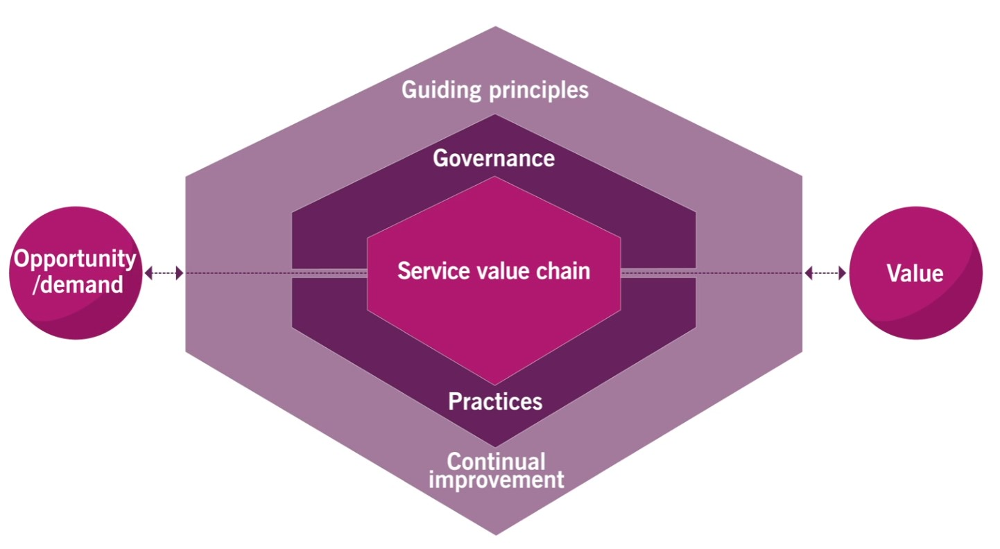
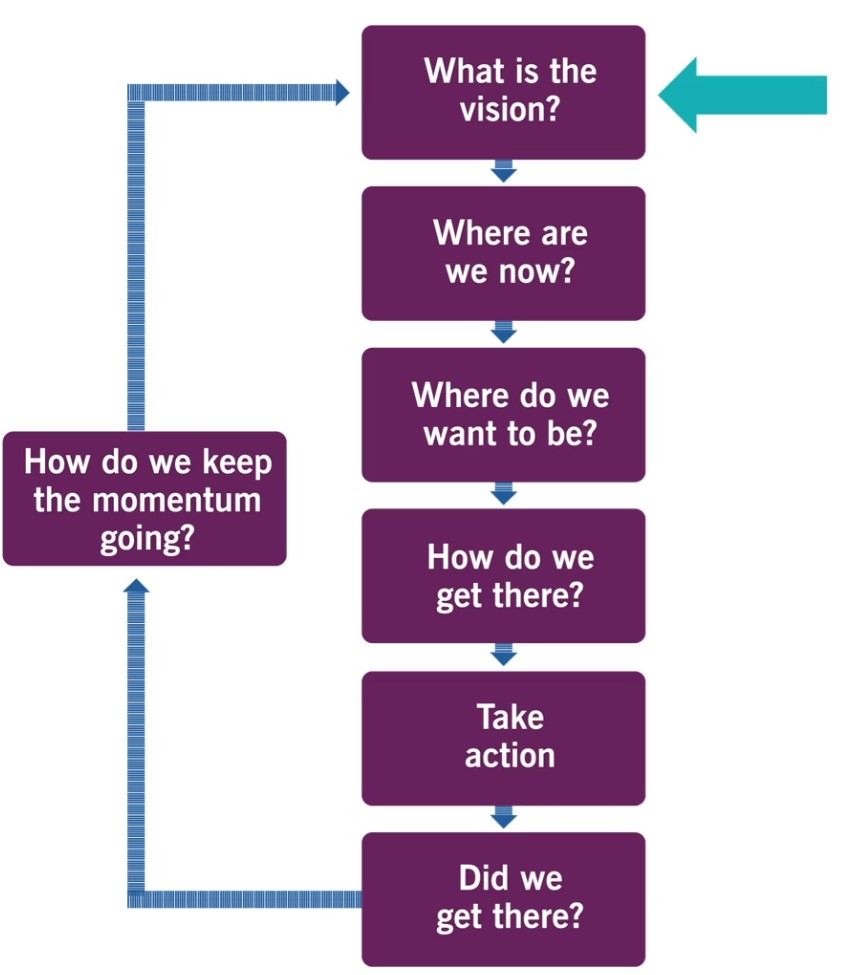

# ITIL (Information Technology Infrastructure Library) 

- ITIL is a set of best practices for IT service management (ITSM) that helps align IT services with business needs.
- ITIL is a framework for service management .
- ITIL began in the 1980s as a way for organizations to create processes and procedures to better run their IT systems. Throughout the last three decades,ITIL became the de facto standard around the world for IT service management.

# Service Organizations
- Entities that provide services to customers, aiming to create value by enabling desired outcomes without customers needing to manage specific costs and risks.

# Service Management
- Definition: A set of specialized organizational capabilities for delivering value to customers in the form of services.
- Focuses on coordinating people, processes, and technology to meet customer needs and facilitate value co-creation.

## Core Concepts in Service Management
### Value
- Definition: In ITIL 4, value is the perceived benefits, usefulness, and importance of something. Value is subjective and co-created with the customer.
### Organization and People
- Ensures that the organizational structure, culture, and people align to support service management. People are key resources in creating, supporting, and optimizing services.
### Services and Products
- Services: Means of enabling value co-creation by delivering outcomes customers want to achieve, without them managing specific costs and risks.
- Products: Configurations of resources offered by the organization to provide value to consumers.

### Service Offerings
- A description of one or more services designed to meet the needs of a target customer group. It includes:
    - **Goods**: Tangible items transferred to the consumer.
    - **Access to Resources**: Allowing consumers to use specific resources under agreed terms.
    - **Service Actions**: Actions performed by the provider to support the consumer (e.g., support, updates).

### Service Relationship
- A cooperation between a service provider and service consumer, including:
    - **Service Provision**: Provider’s activities to deliver services.
    - **Service Consumption**: Consumer’s activities to use the service.
    - **Service Relationship Management**: Managing and improving the relationship to ensure value co-creation.

### Outcome
- Definition: A result for a stakeholder enabled by one or more outputs. Outcomes represent the goals or desired results of using a service.

### Costs
- The financial and non-financial resources required to create and deliver a service. Service providers aim to reduce or control costs for consumers to add value.

### Risks
- Definition: Possible events that could cause harm, loss, or difficulty in achieving objectives. Service providers help mitigate risks, while some risks are assumed by the consumer.

### Utility and Warranty
- **Utility:** The functionality of a service that meets specific needs; it’s what the service does (fit for purpose).
- **Warranty**: Assurance that the service will perform reliably; it’s how the service performs (fit for use).

# The basics of ITIL4 

## Four Dimensions
- These dimensions represent the key areas that must be considered for an organization to create value efficiently and effectively.

###  Organizations and People
- **Focus**: Ensures that an organization's structure, culture, and people align with the service management strategy.
- **Considerations**:
    - Roles and responsibilities: Clearly defining roles to avoid gaps or overlaps.
    - Skills and competencies: Ensuring staff have the required knowledge and skills.
    - Culture and leadership: Promoting a culture that supports ITIL practices and service management.
- **Key Point**: Effective service management relies on collaboration, communication, and a strong culture that supports ongoing improvement and adaptability.

###  Information and Technology
- **Focus**: Considers the information and technological resources needed to deliver services and manage them.
- **Considerations**:
    - IT infrastructure and applications: Supporting service delivery and management.
    - Data and information management: Ensuring information is secure, accessible, and appropriately used.
    - Emerging technologies: Being aware of new tech trends (like AI, automation, and cloud computing) to drive innovation.
- **Key Point**: Technology must align with organizational needs and be managed effectively to support business and IT goals.
  

###  Partners and Suppliers
- **Focus**: Involves managing relationships with external organizations that contribute to service delivery.
- **Considerations**:
    - Strategic partnerships: Leveraging external expertise for IT solutions or services.
    - Supplier management: Ensuring suppliers meet quality and compliance standards.
    - Integrating external services: Ensuring third-party services align with internal processes.
- **Key Point**: Organizations often rely on a network of partners and suppliers, so it’s critical to manage these relationships effectively to ensure seamless service delivery and risk management.
  

### Value Streams and Processes
- **Focus**: Looks at workflows and processes to ensure value delivery to customers efficiently.
- **Considerations**:
    - Value streams: Mapping out steps needed to create and deliver value.
    - Process optimization: Ensuring processes are effective, efficient, and support continuous improvement.
    - Agility and adaptability: Being responsive to changing requirements and environments.
- **Key Point**: Defining clear and efficient processes helps streamline operations, reduce waste, and increase value for both the organization and customers.

## Why the Four Dimensions Matter
These dimensions work together to create a balanced approach to service management. Focusing on just one or a few dimensions without considering the others could result in incomplete or ineffective service management.

## **Service Value System (SVS)**
- **Guiding Principles**: Core recommendations to support service management, such as focusing on value, starting where you are, progressing iteratively, collaborating, and thinking holistically.
- **Governance**: Ensures that policies, roles, and activities align with organizational goals.
- **Service Value Chain**: Core processes and activities needed to deliver and manage services effectively.
- **Continual Improvement**: An approach to ensure constant enhancement of services and processes.
  
  

## Guiding Principle 
1. Focus on Value
2. Start where you are
3. Progress iteratively with feedback
4. Collaborate and promote visibility
5. Think and work holistically
6. Keep it simple and practical
7. Optimize and automate

##   **Service Value Chain**
- The Service Value Chain represents the activities required to create value. These are:
    - **Plan**: Ensure a shared understanding of vision and direction.
    - **Improve**: Continual assessment and improvements to services and products.
    - **Engage**: Interaction with customers to align services with needs.
    - **Design and Transition**: Creating and deploying services effectively.
    - **Obtain/Build**: Resource and service development.
    - **Deliver and Support**: Day-to-day service operations and support.

## Continual Improvement
- A recurring activity that seeks to enhance services, processes, and practices to meet evolving customer needs and expectations.

    

## The 34 Practices
- These are structured sets of organizational resources for performing work or accomplishing an objective. They are categorized into:
    - **General Management Practices**
        - Architecture management
        - Continual improvement
        - Information security
        - Knowledge management
        - Measurement and reporting
        - Organization change management
        - Portfolio management
        - Project management
        - Relationship management
        - Risk management
        - Service financial management
        - Strategy management
        - Supplier management
        - Workforce and talent management
  
    - **Service Management Practices**
        - Availability management
        - Business analysis
        - Capacity and performance management
        - Change enablement
        - Incident management
        - IT asset management
        - Monitoring and event management
        - Problem management
        - Release management
        - Service catalog management
        - Service configuration management
        - Service continuity management
        - Service design
        - Service desk
        - Service level management
        - Service request management
        - Service validation and testing
  
    - **Technical Management Practices**
        - Deployment Management
        - Infrastructure and Platform Management
        - Software Development and Management

##  **Practices (Processes)**
- ITIL practices help in implementing the Service Value Chain. They’re divided into three categories:
    - **General Management Practices** (e.g., Continual Improvement, Project Management).
    - **Service Management Practices** (e.g., Incident Management, Problem Management, Change Control, Service Desk).
    - **Technical Management Practices** (e.g., Deployment Management, Infrastructure and Platform Management).

1.  **Key ITIL Practices**
    - **Incident Management**: Resolve incidents quickly to minimize service disruption.
    - **Problem Management**: Identify and address root causes to prevent incidents.
    - **Change Control**: Ensure changes are made with minimal disruption.
    - **Service Desk:** Acts as the single point of contact between service providers and users.
    - **Service Level Management**: Ensures services meet agreed-upon performance standards.
    - **Configuration Management**: Manages data about the infrastructure and configuration items.
    - **Release Management:** Coordinates new service rollouts to minimize disruptions.

2. **ITIL 4 Concepts**
    - ITIL 4, the latest version, emphasizes flexibility and Agile principles, making it more adaptable to modern business environments. It includes value creation, co-creation with users, and links well with practices like DevOps.

## Benefits of ITIL in Service Management
- Improved service quality and alignment with business objectives.
- Enhanced efficiency through standardized processes.
- Greater customer satisfaction due to consistent, reliable service.
- Reduced risks and improved incident response times.
