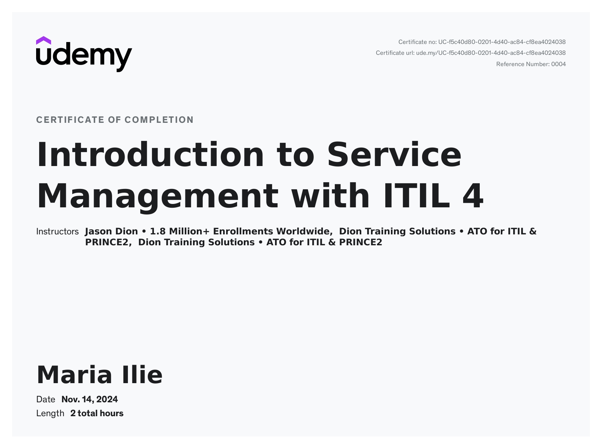
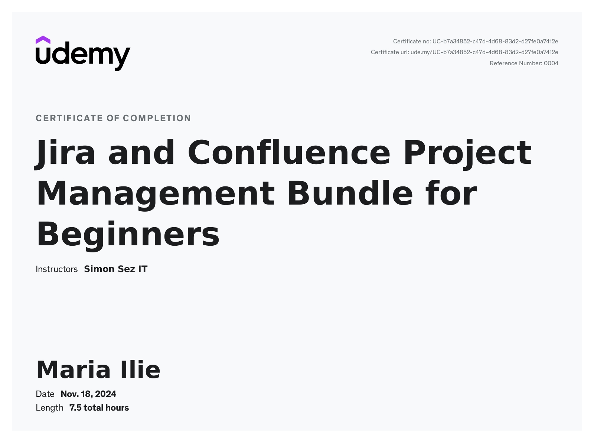
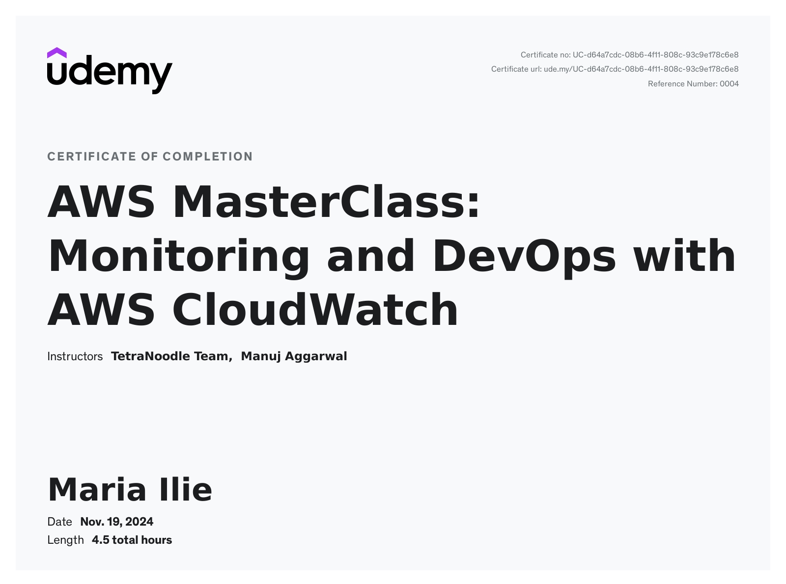
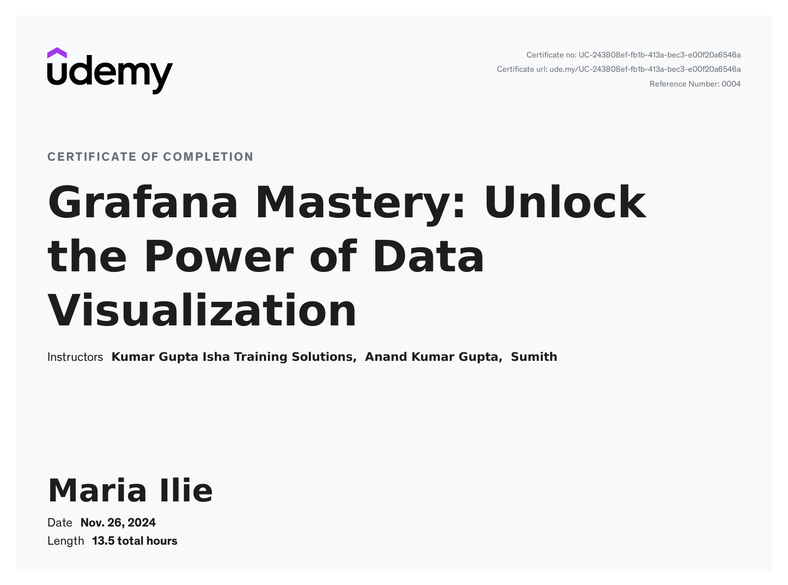

- [Service Management](#service-management)
  - [ITIL](#itil)
- [Project Management](#project-management)
  - [JIRA](#jira)
  - [Confluence](#confluence)
- [Monitoring and data visualisation](#monitoring-and-data-visualisation)
  - [AWS MasterClass: Monitoring and DevOps with AWS CloudWatch](#aws-masterclass-monitoring-and-devops-with-aws-cloudwatch)
  - [Grafana Mastery: Unlock the Power of Data Visualization](#grafana-mastery-unlock-the-power-of-data-visualization)
  - 
- [Project - Deploy Java Spring Boot App](#project---deploy-java-spring-boot-app)
- [AWS](#aws)
- [Terraform](#terraform)
- [Docker and Kubernetes](#docker-and-kubernetes)

# Service Management 

## ITIL 
1. Introduction to Service Management with ITIL 4 [ITIL](ITIL-service-management/README.md)
   
2. Certificate : 

# Project Management

1. Certificate: 

## JIRA
[JIRA](Project-Management/README.md)

## Confluence 

[Confluence](Project-Management/README.md)

--- 
# Monitoring and data visualisation
1. Certificate : 

   
## AWS MasterClass: Monitoring and DevOps with AWS CloudWatch
1. CloudWatch [CloudWatch](AWS-MasterClass/README.md)
2. AWS-EC2 [aws-ec2-monitoring](AWS-MasterClass/AWS-EC2.md)
3. AWS-EBS [aws-ebs-monitoring](AWS-MasterClass/AWS-EC2.md)
4. AWS-RDS [aws-rds-monitoring](AWS-MasterClass/AWS_RDS.md)
5. AWS-ELB [aws-ebs-monitoring](AWS-MasterClass/AWS-EBS.md)
6. AWS-Billing-Costs [aws-billing-costs](AWS-MasterClass/AWS-Billing-Costs.md)
7. Introduction to AWS [aws-intro](AWS-MasterClass/Intro-AWS.md)
  

## Grafana Mastery: Unlock the Power of Data Visualization
---
[Grafana and Prometheus](Grafana/README.md)

---
# Project - Deploy Java Spring Boot App
---

---
# AWS
---

---
# Terraform
---

---
# Docker and Kubernetes
---