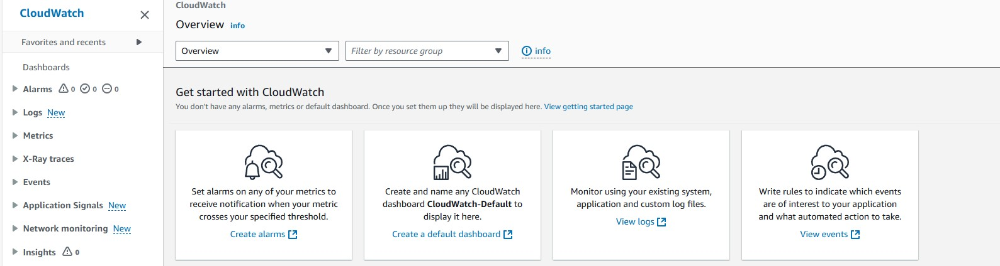

- [AWS MasterClass:](#aws-masterclass)
- [Monitoring and Alerting on AWS](#monitoring-and-alerting-on-aws)
  - [What Can Be Monitored on AWS?](#what-can-be-monitored-on-aws)
  - [AWS Metrics](#aws-metrics)
  - [What is AWS CloudWatch?](#what-is-aws-cloudwatch)
  - [Monitoring Metrics via AWS CloudWatch](#monitoring-metrics-via-aws-cloudwatch)
  - [AWS SNS (Simple Notification Service)](#aws-sns-simple-notification-service)
  - [CloudWatch Alarm States](#cloudwatch-alarm-states)
  - [Integration with Other AWS Services](#integration-with-other-aws-services)
  - [Core Features of CloudWatch](#core-features-of-cloudwatch)
- [AWS CloudWatch Dashboards](#aws-cloudwatch-dashboards)
  - [What Are AWS CloudWatch Dashboards?](#what-are-aws-cloudwatch-dashboards)
  - [Benefits of CloudWatch Dashboards](#benefits-of-cloudwatch-dashboards)
  - [How to Create an AWS CloudWatch Dashboard](#how-to-create-an-aws-cloudwatch-dashboard)
    - [**Step 1: Access CloudWatch**](#step-1-access-cloudwatch)
    - [**Step 2: Create a Dashboard**](#step-2-create-a-dashboard)
    - [**Step 3: Add Metrics to Widgets**](#step-3-add-metrics-to-widgets)
    - [**Step 4: Configure the Dashboard Layout**](#step-4-configure-the-dashboard-layout)
    - [**Step 5: Add Alarms (Optional)**](#step-5-add-alarms-optional)
    - [**Step 6: Share the Dashboard**](#step-6-share-the-dashboard)
    - [**Step 7: Monitor and Adjust**](#step-7-monitor-and-adjust)
  - [Best Practices for CloudWatch Dashboards](#best-practices-for-cloudwatch-dashboards)
  - [Automating Dashboard Creation with AWS CLI](#automating-dashboard-creation-with-aws-cli)
- [AWS CloudWatch Alarms](#aws-cloudwatch-alarms)
  - [What Are AWS CloudWatch Alarms?](#what-are-aws-cloudwatch-alarms)
  - [Benefits of CloudWatch Alarms](#benefits-of-cloudwatch-alarms)
  - [How to Create AWS CloudWatch Alarms](#how-to-create-aws-cloudwatch-alarms)
    - [**Step 1: Access CloudWatch**](#step-1-access-cloudwatch-1)
    - [**Step 2: Go to the Alarms Section**](#step-2-go-to-the-alarms-section)
    - [**Step 3: Select a Metric**](#step-3-select-a-metric)
    - [**Step 4: Define the Alarm Conditions**](#step-4-define-the-alarm-conditions)
    - [**Step 5: Configure Actions**](#step-5-configure-actions)
    - [**Step 6: Name and Review the Alarm**](#step-6-name-and-review-the-alarm)
  - [Testing the Alarm](#testing-the-alarm)
  - [Automating CloudWatch Alarms Using AWS CLI](#automating-cloudwatch-alarms-using-aws-cli)
  - [Use Cases for CloudWatch Alarms](#use-cases-for-cloudwatch-alarms)
- [AWS CloudWatch Features](#aws-cloudwatch-features)


# AWS MasterClass:

AWS provides various monitoring tools to help users track the performance, health, and availability of their resources. These tools enable real-time data collection, log analysis, alerting, and automated responses for efficient infrastructure management.


# Monitoring and Alerting on AWS
 **AWS CloudWatch** is the defacto monitoring service on AWS which monitors key metrics of various AWS services like:
  - **AWS EC2**
  - **Elastic Load Balancer**
  - **Elastic Block Store** and many others.

**AWS SNS** (Simple Notification Service) and **AWS SES** (Simple Email Service) can be used for alerting within AWS.




## What Can Be Monitored on AWS?
On AWS, you can monitor the following resources:

- **Compute Services:**
  - EC2 instances
  - Lambda functions
  - Elastic Beanstalk
- **Storage Services:**
  - S3 buckets
  - EBS volumes
- **Database Services:**
  - RDS instances
  - DynamoDB tables
  - ElastiCache
- **Networking:**
  - Elastic Load Balancers (ELB)
  - VPC flow logs
  - Route 53
- **Containers:**
  - ECS clusters
  - EKS clusters
- **Application and User Metrics:**
  - API Gateway
  - CloudFront
  - CloudFormation
  - Application logs
- **Custom Metrics:**
  - User-defined application or infrastructure-specific metrics.

---

## AWS Metrics
Metrics are measurable values that provide insight into the performance and behavior of AWS resources. Common categories of AWS metrics include:

- **Compute Metrics:**
  - CPU utilization
  - Memory usage
  - Disk I/O
- **Network Metrics:**
  - Incoming/outgoing traffic
  - Network packets
  - Latency
- **Storage Metrics:**
  - Read/write operations
  - Free space
  - Burst balance (for EBS)
- **Application Metrics:**
  - HTTP response codes
  - Request count
  - Latency
- **Custom Metrics:**
  - Application-specific metrics sent via CloudWatch API.

---

## What is AWS CloudWatch?
**AWS CloudWatch** is a monitoring and observability service designed to track the performance and health of AWS resources and applications. It provides:

- Monitoring of system-wide metrics like CPU usage, disk I/O, and network activity.
- Centralized log collection and analysis.
- Alarms to notify you when metrics cross defined thresholds.
- Custom dashboards to visualize metrics in real-time.
- Integration with other AWS services for automated responses.

---

## Monitoring Metrics via AWS CloudWatch
CloudWatch enables users to:

1. **Collect Metrics:**
   - Default metrics (e.g., CPU utilization for EC2).
   - Custom metrics using the CloudWatch API.
2. **Set Alarms:**
   - Trigger notifications or automated actions when a threshold is exceeded.
3. **Analyze Logs:**
   - Collect and analyze logs using **CloudWatch Logs**.
4. **Create Dashboards:**
   - Visualize metrics from multiple resources in one place.
5. **Use Insights:**
   - Query log data to troubleshoot performance issues.

---

## AWS SNS (Simple Notification Service)
AWS SNS is a fully managed messaging service for sending alerts and notifications. It is often used alongside CloudWatch to:

- **Send Alerts:**
  - Notify users when CloudWatch alarms are triggered.
- **Distribute Messages:**
  - Publish messages to multiple subscribers (e.g., email, SMS, Lambda functions, SQS).
- **Integration:**
  - Combine with other AWS services like Lambda for event-driven workflows.
- **Use Cases:**
  - Incident management
  - Application status updates
  - Security alerts


## CloudWatch Alarm States

- `OK State`: Metric within defined threshold, alarm not triggered.
- `Alarm State`: Metric outside defined threshold, alarm triggered.
- `Insufficient Data`: Not enough data to determine alarm state.

## Integration with Other AWS Services
- **SNS**: Sending notifications via email, SMS, HTTP, HTTPS.
- **SQS and Lambda**: Further integration for enhanced functionality.
- **Autoscaling**: Automatically scale EC2 instances based on alarms.
- **Continuous Integration**: Rich integration with various AWS services, with more being added.


## Core Features of CloudWatch
- **Visualisation**: Display multiple metrics on a single graph.
- **Dashboards**: Consolidated view of metrics with text and images.
- **Customisation**: Build multiple dashboards for different views.
- **Global View**: Pull data from multiple AWS regions into a single dashboard.


# AWS CloudWatch Dashboards

---

## What Are AWS CloudWatch Dashboards?
**AWS CloudWatch Dashboards** are customizable homepages for monitoring the health and performance of your cloud infrastructure. They allow you to visualize metrics, logs, and alarms from multiple AWS resources in one centralized location.

---

## Benefits of CloudWatch Dashboards
- **Centralized Monitoring:** View multiple AWS resources on one screen.
- **Customizable Widgets:** Display metrics, logs, and alarms using widgets.
- **Real-Time Insights:** Get live updates on the performance of your AWS infrastructure.
- **Cross-Region Monitoring:** Include metrics from multiple AWS regions in one dashboard.
- **Collaboration:** Share dashboards with team members for collaborative monitoring.

---

## How to Create an AWS CloudWatch Dashboard

### **Step 1: Access CloudWatch**
1. Log in to your [AWS Management Console](https://aws.amazon.com/console/).
2. Navigate to **CloudWatch** by searching for it in the services search bar.

---

### **Step 2: Create a Dashboard**
1. **Go to the Dashboards Section:**
   - In the left-hand menu, click on **Dashboards**.
2. **Create a New Dashboard:**
   - Click **Create dashboard**.
3. **Enter a Name:**
   - Provide a meaningful name for the dashboard (e.g., `MyInfrastructureDashboard`).
4. **Add Widgets:**
   - Choose the type of widget you want to add, such as:
     - **Line graphs:** For visualizing metrics over time.
     - **Number widgets:** For displaying single metric values.
     - **Text widgets:** For adding descriptions or instructions.
   - Click **Configure** to customize the widget and associate it with a metric or log group.

---

### **Step 3: Add Metrics to Widgets**
1. **Choose a Metric:**
   - For each widget, select a resource and the corresponding metric (e.g., EC2 CPU Utilization, RDS Read/Write Throughput).
2. **Customize the Widget:**
   - Configure options like the time period, granularity, and axis scale.
3. **Save the Widget:**
   - Once configured, click **Add to dashboard**.

---

### **Step 4: Configure the Dashboard Layout**
1. **Drag and Resize Widgets:**
   - Arrange widgets by dragging them and resizing to fit your needs.
2. **Add Multiple Widgets:**
   - Repeat the process to add widgets for different AWS services or resources.
3. **Save the Layout:**
   - Click **Save dashboard** to retain your changes.

---

### **Step 5: Add Alarms (Optional)**
1. **Go to CloudWatch Alarms:**
   - In the left-hand menu, click **Alarms**.
2. **Create an Alarm:**
   - Define an alarm for a specific metric (e.g., EC2 CPU usage > 80%).
3. **Add Alarm Widgets:**
   - Return to the dashboard and add a **Number Widget** to display the status of the alarm.

---

### **Step 6: Share the Dashboard**
1. **Set Permissions:**
   - Use AWS Identity and Access Management (IAM) to grant dashboard access to team members.
2. **Share Across Accounts:**
   - You can make dashboards cross-account accessible by using IAM roles or policies.

---

### **Step 7: Monitor and Adjust**
1. **Monitor Regularly:**
   - Use the dashboard for real-time insights into your infrastructure.
2. **Edit as Needed:**
   - Add or remove widgets as your monitoring needs change.

---

## Best Practices for CloudWatch Dashboards
1. **Keep It Simple:**
   - Focus on the key metrics that matter most to your application or infrastructure.
2. **Organize Widgets Logically:**
   - Group related widgets together for clarity (e.g., EC2 metrics in one section, RDS metrics in another).
3. **Use Multiple Dashboards:**
   - Create separate dashboards for different teams or purposes (e.g., DevOps, security, cost monitoring).
4. **Enable Alarms:**
   - Use alarms to highlight critical issues directly on the dashboard.
5. **Leverage Cross-Region Metrics:**
   - Include metrics from different AWS regions if your application spans multiple locations.

---

## Automating Dashboard Creation with AWS CLI
1. **Create a Dashboard:**
   ```bash
   aws cloudwatch put-dashboard --dashboard-name MyDashboard --dashboard-body '{
       "widgets": [
           {
               "type": "metric",
               "x": 0,
               "y": 0,
               "width": 12,
               "height": 6,
               "properties": {
                   "metrics": [
                       [ "AWS/EC2", "CPUUtilization", "InstanceId", "i-0123456789abcdef0" ]
                   ],
                   "period": 300,
                   "stat": "Average",
                   "region": "us-east-1",
                   "title": "EC2 CPU Utilization"
               }
           }
       ]
   }'


2. **View the Dashboard**:
   - Open the AWS Console, navigate to CloudWatch, and select the newly created dashboard.


# AWS CloudWatch Alarms  
A step-by-step guide to create and configure AWS CloudWatch Alarms to monitor and respond to specific conditions in your cloud infrastructure.

---

## What Are AWS CloudWatch Alarms?  
**AWS CloudWatch Alarms** monitor specific metrics and perform predefined actions when those metrics cross a specified threshold. They can notify users, trigger automated responses, or invoke AWS services like Lambda.

---

## Benefits of CloudWatch Alarms
- **Real-Time Monitoring:** Immediate alerts when metrics breach thresholds.
- **Automation:** Trigger actions like scaling, notifications, or custom workflows.
- **Integration:** Seamlessly integrates with other AWS services (SNS, EC2 Auto Scaling, Lambda).
- **Customization:** Flexible thresholds, conditions, and evaluation periods.

---

## How to Create AWS CloudWatch Alarms  

### **Step 1: Access CloudWatch**
1. Log in to your [AWS Management Console](https://aws.amazon.com/console/).
2. Navigate to **CloudWatch**.

---

### **Step 2: Go to the Alarms Section**
1. In the left-hand menu, click **Alarms**.
2. Click **Create alarm**.

---

### **Step 3: Select a Metric**
1. **Choose Metric:**
   - Click **Select metric**.
   - Browse or search for a metric (e.g., EC2, RDS, DynamoDB, or custom metrics).
2. **Filter the Metric:**
   - For example, select **EC2 > Per-Instance Metrics > CPUUtilization** and choose the desired instance.
3. Click **Select metric** to confirm.

---

### **Step 4: Define the Alarm Conditions**
1. **Specify the Threshold Type:**
   - Static: Set a specific value (e.g., CPU Utilization > 80%).
   - Anomaly Detection (optional): Use machine learning to detect deviations.
2. **Set Threshold Value:**
   - For example: Trigger the alarm when CPU Utilization exceeds 80%.
3. **Define the Evaluation Period:**
   - Set how many consecutive periods must breach the threshold to trigger the alarm (e.g., 2 periods of 5 minutes each).

---

### **Step 5: Configure Actions**
1. **Choose Alarm Actions:**
   - Specify what happens when the alarm state changes:
     - **In Alarm (breaches threshold):** Notify via **Amazon SNS** or trigger actions like scaling.
     - **OK (threshold cleared):** Notify or reset actions.
     - **Insufficient Data:** Define actions when data is unavailable.
2. **Set Up Notifications (Optional):**
   - Select an existing SNS topic or create a new one.
   - For email notifications, provide an email address and confirm the subscription.

---

### **Step 6: Name and Review the Alarm**
1. **Give a Name:**
   - Enter a descriptive name for the alarm (e.g., `HighCPUAlarm`).
2. **Review Settings:**
   - Verify all configurations before proceeding.
3. **Create the Alarm:**
   - Click **Create alarm**.

---

## Testing the Alarm
1. Simulate the alarm condition (e.g., generate high CPU usage on an EC2 instance).
2. Monitor the alarm state in the **Alarms** section:
   - **OK:** Normal conditions.
   - **In Alarm:** Threshold breached.
   - **Insufficient Data:** Data is missing or incomplete.

---

## Automating CloudWatch Alarms Using AWS CLI
1. **Create an Alarm:**
   ```bash
   aws cloudwatch put-metric-alarm \
   --alarm-name HighCPUAlarm \
   --metric-name CPUUtilization \
   --namespace AWS/EC2 \
   --statistic Average \
   --period 300 \
   --threshold 80 \
   --comparison-operator GreaterThanThreshold \
   --dimensions Name=InstanceId,Value=i-0123456789abcdef0 \
   --evaluation-periods 2 \
   --alarm-actions arn:aws:sns:us-east-1:123456789012:MySNSTopic

## Use Cases for CloudWatch Alarms
1. **EC2 Monitoring:**
Alert on high CPU or disk usage.
2. **RDS Databases**:
Notify when read/write throughput exceeds thresholds.
3. **Auto Scaling**:
Scale EC2 instances when alarms are triggered.
4. **Custom Metrics**:
Track and alert on application-specific metrics.


# AWS CloudWatch Features  

- Alarms 
- Billing 
- Events
- Logs
- Metrics
- Autoscaling Integration 
- Reboot Failed EC2 Instances
- Third Party Integration
- Create Custom Metrics
- Memory Utilization
- Memory Used
- Memory Available
- Disk Space Utilization
- Disk Space Used
- Disk Space Available
- Swap Space Utilization
- Swap Space Used


