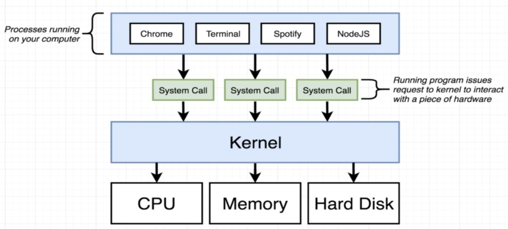
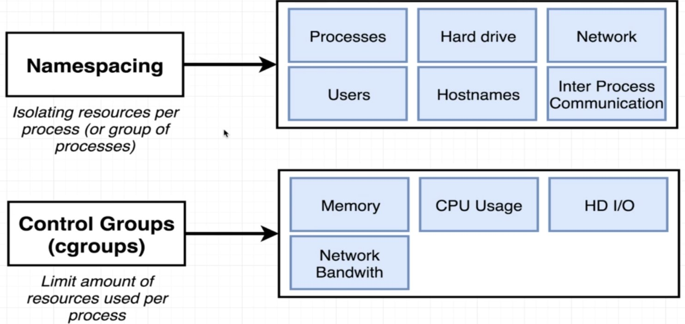
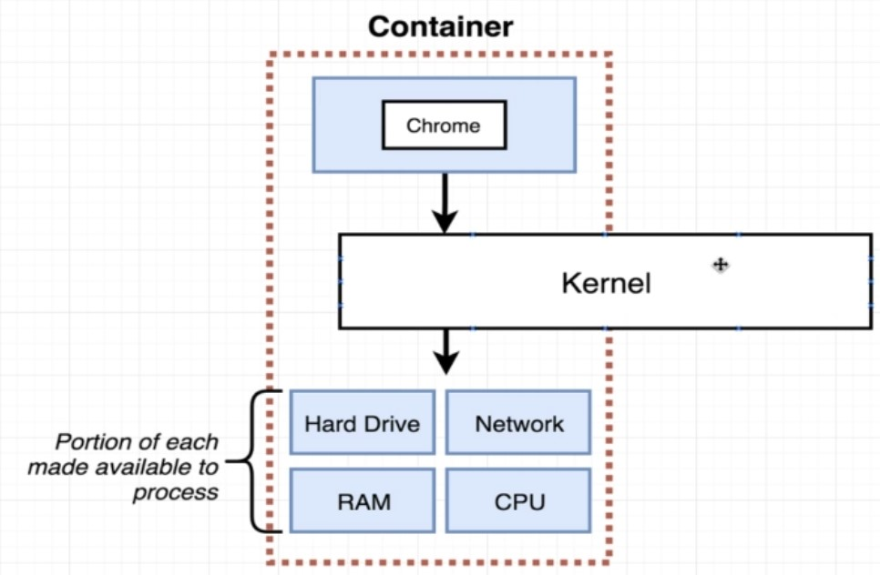
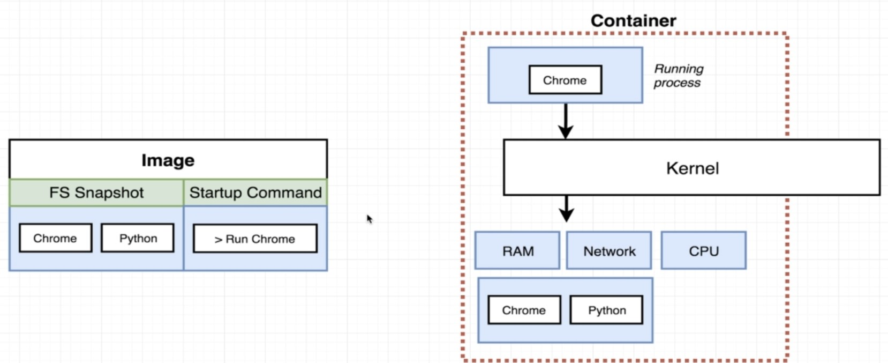
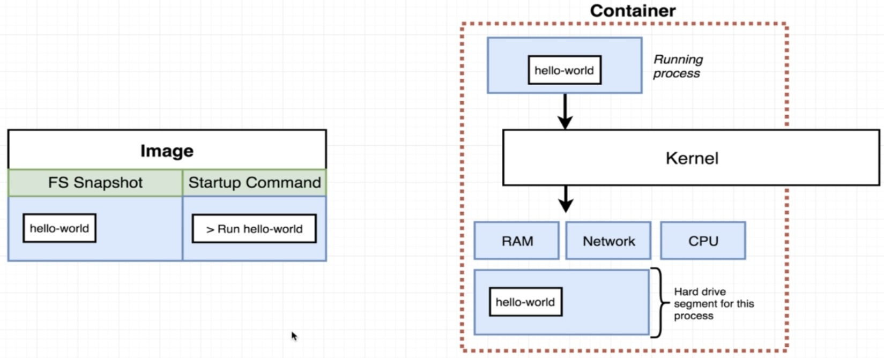
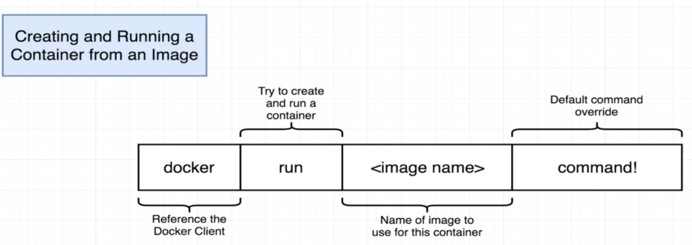
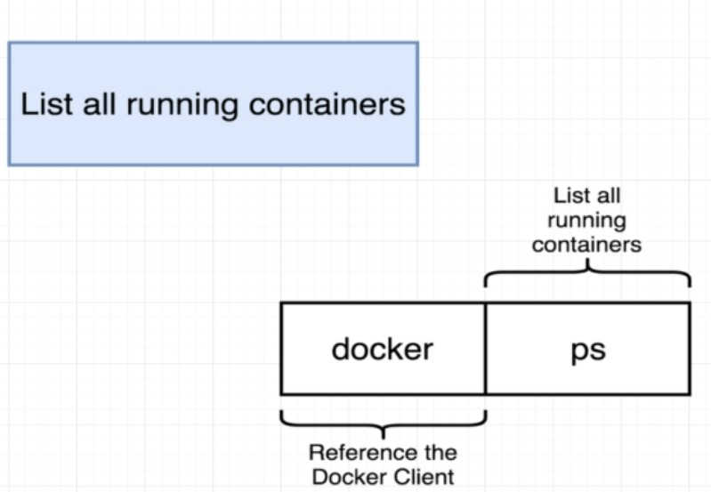
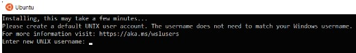
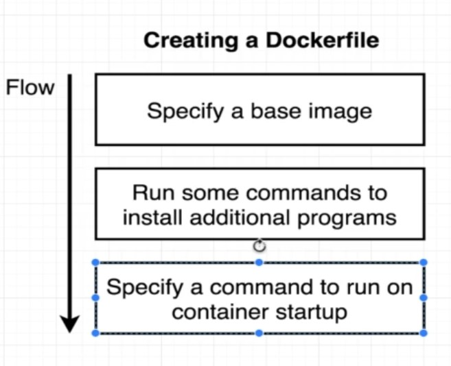

# Docker and Kubernetes

# Docker

## Why use Docker?
- Docker makes it really easy to install and run software without worrying about setup or dependencies

## What is Docker?
- Docker is a platform or ecosystem around creating and running containers 

Docker CLI reach out to Docker Hub and download an Image( single file with all the deps and config required to run a program) 
Use this image to create containers(instance of an image. Runs a program).


## Installing Docker with WSL on Windows 10/11

1. Register for a DockerHub account
    https://hub.docker.com/signup
2. Download and install all pending Windows OS updates
3. Run the WSL install script

    *Note - If you have previously enabled WSL and installed a distribution you may skip to step #7*
    - Open PowerShell as Administrator and run: wsl --install
    - This will enable and install all required features as well as install Ubuntu.

        
    - Official documentation:
    https://docs.microsoft.com/en-us/windows/wsl/install#install-wsl-command

4. Reboot your computer
5. Set a Username and Password in Ubuntu
   
    After the reboot, Windows will auto-launch your new Ubuntu OS and prompt you to set a username and password.
    
    

6. Manually Installing a Distribution
   
    If for some reason Windows did not prompt you to create a distribution or you simply would like to create a new one, you can do so by running the following command:
    `wsl --install -d Ubuntu`

7. Install Docker Desktop
   
    Navigate to the Docker Desktop installation page and click the Docker Desktop for Windows button:
    https://docs.docker.com/desktop/install/windows-install/
    
    

8. Double-click the Docker Desktop Installer from your Downloads folder

9.  Click "Install anyway" if warned the app isn't Microsoft-verified
10. Click "OK" to Add a shortcut to the Desktop

    

11. Click "Close" when you see Installation succeeded message

    

12. Double-click the Docker Desktop icon on your Desktop

13. Accept the Docker Service Agreement

    

14. Docker Desktop will launch for the first time

15. Ensure that WSL Integration is Enabled

    

16. Open your Distro
    
    Using the Windows Search feature in the toolbar, type the name of your distribution (by default it is Ubuntu) and click Open:

    

17. Check that Docker is working
    
    Using the terminal for your distro, run the docker command. If all is well you should see some helpful instructions in the output similar to below:
    
    

18. Log in to Docker
    
    Using the terminal for your distro, run the docker login command. You will be prompted to enter the username and password (or your Personal Access Token) you created earlier when registering for a DockerHub account


# Installing Docker on Linux

## Installation of Docker Desktop on Native Hardware
*Native Hardware means a physical laptop or desktop computer. If you are using WSL on Windows, then you should be installing Docker Desktop for Windows NOT Linux. If you are installing within a VM like VirtualBox or Parallels, or, a cloud server such as AWS, then, you must use the Installation on Cloud Servers or inside Virtual Machines instructions instead.* 

- **Docker Desktop does not work with nested virtualization.**
- Currently Docker Desktop currently only works with the **Ubuntu**, **Debian**, or **Fedora** distributions. If you are using any other distribution, you will need to follow the "Installation on Cloud Servers or inside Virtual Machines" instructions.

1. **Create Dockerhub account**
https://hub.docker.com/signup

1. **Install Docker Desktop for Linux**

    - Simply follow the generic installation instructions for your particular distribution:

        https://docs.docker.com/desktop/install/linux-install/#generic-installation-steps

2. **Login to the Dockerhub**
   
    In order to push and pull images, you will need to log in to the Dockerhub. In your terminal, run docker login and then enter your Dockerhub account username and password.


4. **Test Docker installation**

    After completing the installation steps, test out Docker by running docker run hello-world. This should download and run the test container printing "hello world" to your console. 


## Installation on Cloud Servers or inside Virtual Machines

*The steps listed below are for Ubuntu Desktop LTS. You can find the full official docs and steps for other Linux distributions here:*

- Ubuntu: https://docs.docker.com/install/linux/docker-ce/ubuntu/
- CentOS: https://docs.docker.com/install/linux/docker-ce/centos/
- Debian: https://docs.docker.com/install/linux/docker-ce/debian/

1. **Create Dockerhub account**
https://hub.docker.com/signup

2. **Install Docker**
   
    The Docker docs suggest setting up a Docker repository to install and update from.
    This is where you should start: https://docs.docker.com/engine/install/ubuntu/#install-using-the-repository

3. **Login to the Dockerhub**
     
     In order to push and pull images, you will need to log in to the Dockerhub. In your terminal, run `docker login` and then enter your Dockerhub account username and password.

4. **Test Docker installation**

    After completing the installation steps, test out Docker by running `sudo docker run hello-world`. This should download and run the test container printing "hello world" to your console.

5. **Testing Docker Compose**
    
    **Important!** The version of Docker Compose that is now installed with Docker does not include a symlink to the docker-compose (with a hyphen) command. This only exists in Docker Desktop. So, all commands should be run without a hyphen.
    After completing, test your installation by running:
    `docker compose -v`
    This should print the version and build numbers to your console.

6. **Run without Sudo**
   
    Follow these instructions to run Docker commands without sudo:
    https://docs.docker.com/install/linux/linux-postinstall/#manage-docker-as-a-non-root-user

7. **Start on Boot**
    
    Follow these instructions so that Docker and its services start automatically on boot:
    https://docs.docker.com/install/linux/linux-postinstall/#configure-docker-to-start-on-boot


# What is a container







- how to make container after an image
  
    


# Docker CLI

1. Creating and Running a container from an image 
    ```bash
    docker run <image name>
    ```
     ```bash
    docker run hello-world
    ```

    

2. Overriding default commands
    ```bash
    docker run busybox echo hi there
    ```

    

3. Listing runningg containers
   ```bash
    docker ps
    ```

    

    ```bash
    docker ps --all
    ```

4. Container Lifecycle
   
    `docker run = docker create + docker start` 

5. Restarting stopped container
   ```bash 
   docker start <container id>
   ```
    ```bash 
   docker start -a  <container id>
   ```

6. Removing stopped containers
    ```bash
    docker system prune 
    ```

7. Retrieving log outputs 
    ```bash
    docker logs <container id>
    ``` 

8. Stopping containers 
    ```bash
    docker stop <container id>
    ```
    ```bash
    docker kill <container id>
    ```
9. Executing cmd in running containers
    
    ```bash
    docker exec -it <container id> <command>
    ```

10. Getting a cmd prompt in a container
    ```bash
    docker exec -it <container id> sh
    ```
11. Starting with a shell
    ```bash
    docker run -it <image name> sh 
    ```

# Docker Images 



## Dockerfile



