# Grafana 
- Grafana is an open-source platform for monitoring, visualization, and analysis of metrics and log data. It is commonly used with data sources like Prometheus, Elasticsearch, and more.


## Different Grafana Offerings

- **Grafana Enterprise**: Paid solution with support from Grafana Labs.
- **Grafana OS (Open Source)**: Community-supported, free but no enterprise support.
- **Grafana Cloud (SaaS)**: Fully managed by Grafana Labs, with pricing based on usage.

## Why Grafana?

- Rich and customizable visualization capabilities.
- Supports multiple data sources.
- Integration with Prometheus, InfluxDB, and other databases for monitoring and metrics.

## Key Features of Grafana:
1. **Customizable Dashboards**:
   - Build visually appealing, interactive dashboards using drag-and-drop panels.
2. **Wide Range of Data Sources**:
    - Supports Prometheus, Elasticsearch, InfluxDB, AWS CloudWatch, PostgreSQL, MySQL, and more.
3. **Plugins and Extensions:**
    - Grafana plugins extend functionality with new data sources and visualization types.
4. **Alerting**:
    - Alerts users when predefined thresholds are crossed. Integrates with email, Slack, PagerDuty, etc.
5. **Advanced Visualization**:
    - Includes graphs, gauges, heatmaps, bar charts, and tables.
6. **Templating:**
   - Dynamic dashboards with variables for filtering and interacting with data.
7. **Access Control:**
    - Role-based access control (RBAC) for managing permissions.
8. **Annotations**:
    - Add comments or notes directly on graphs for troubleshooting or historical analysis.
9. **Cloud or On-Prem Deployment**:
    - Deployable as SaaS (Grafana Cloud) or on-premises.
10. **Integration with Prometheus**:
    - Natively integrates with Prometheus for enhanced visualization of metrics.


## Data collection: 3 scenarios 

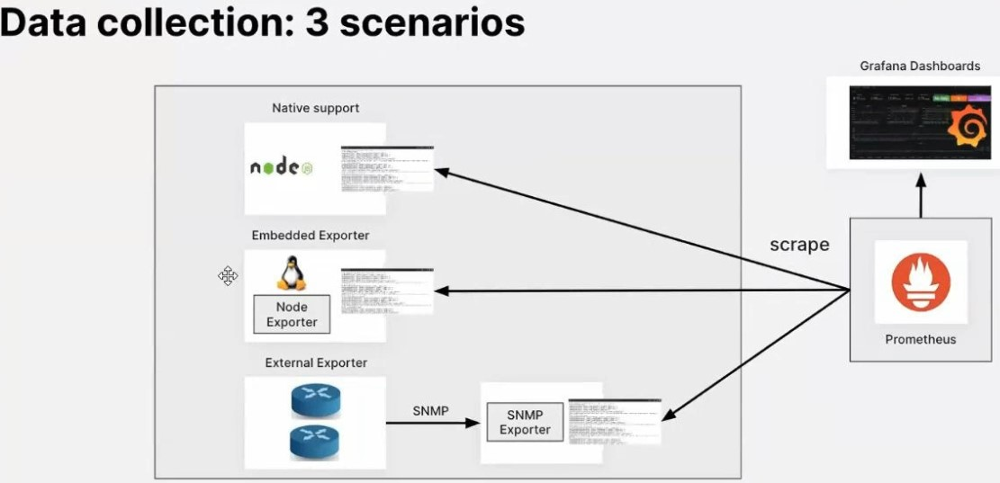

-  The image outlines **three scenarios for data collection** in a monitoring stack that integrates **Prometheus** for data scraping and **Grafana** for data visualization.


1.  **Native Support**
    - **Description**: Some applications, like **Node.js**, provide built-in metrics collection capabilities and expose these metrics natively.
    - **How it works**:
      - The application (e.g., Node.js) exports metrics directly.
      - Prometheus scrapes these metrics from the exposed endpoint.
      - Grafana visualizes the scraped metrics in customizable dashboards.


2. **Embedded Exporter**
    - **Description**: Metrics are collected using an **exporter** running on the same host as the monitored system. For example, **Node Exporter** is used to collect infrastructure-level metrics such as CPU, memory, and disk usage from Linux systems.
    - **How it works**:
       - The **Node Exporter** collects metrics from the system.
       - The metrics are exposed on a specific port.
       - Prometheus scrapes these metrics from the exporter.
       - Grafana visualizes these metrics in dashboards.


3. **External Exporter**
   - **Description**: For external systems like network devices, a specialized exporter (e.g., SNMP Exporter) is used to collect metrics.
   - **How it works**:
      - The exporter collects metrics via a protocol like **SNMP** from the external devices (e.g., routers or switches).
      - These metrics are exposed via an endpoint by the exporter.
      - Prometheus scrapes the metrics from this endpoint.
      - Grafana visualizes the scraped data.


# Dockerized Grafana Installation
## Deployed Grafana on an AWS EC2 instance using Docker.
## Steps
1. **Launched an EC2 instance with Amazon Linux**.
   - Log into AWS.
   - Change region: Ireland (eu-west-1).
   - Click "Launch Instance".
   - Name: tech264-maria-grafana
   - Image: Ubuntu Server 22.04 (free tier eligible).
   - Size: t3.micro
   - Security group:
     - Name: tech264-maria-grafana-allow-ssh-3000
     - Allow SSH and port 3000 (Grafana default port) for HTTP .

2. **SSH in to Connect**
    - Navigate to your .ssh folder.
    - On AWS, click "Connect" on your EC2 instance.
        - Copy this code into the .ssh folder to connect to the instance.
        - type 'yes' for fingerprint credentials.

3. **Installed Docker**.

    - Update Package List: `sudo apt-get update`
    - Install Docker: `sudo apt-get install docker.io`
      - Give it permision ('y').
    - Start Docker Service: `sudo systemctl start docker`
    - Check docker status: `sudo systemctl status docker`
      - Type "q" to exit.
    - Enable Docker to Start at Boot: `sudo systemctl enable docker`

4. **Pull the Grafana Docker Image**
    1. **Solution 1: Run the Command with sudo**
        ```bash
        sudo docker pull grafana/grafana
        ```
    2. Solution 2: Add Your User to the Docker Group
        ```bash
        sudo usermod -aG docker $USER
        ```


5. **Run the Grafana Container**
   
   1. Run the Grafana Container:
        ```bash
        sudo docker run -d --name grafana -p 3000:3000 grafana/grafana
        ```
    2. Verify the Running Container:
        ```bash
        docker ps
        ```

6. **Access Grafana UI**
    1. Open a browser and navigate to:
        ```vbnet
        http://<public-ip>:3000
        ```

        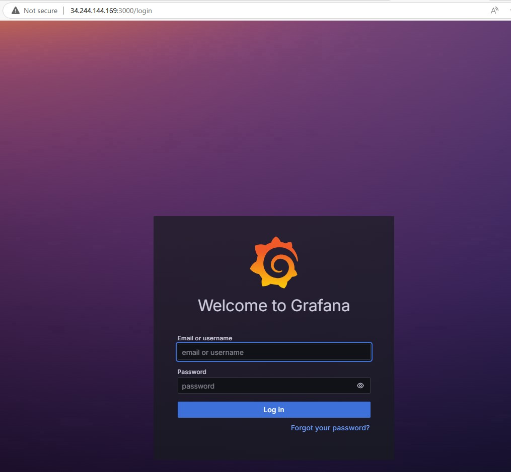


    2. Login to Grafana:
        - Default username: `admin`
        - Default password: `admin`
        - Change the password on the first login.

        - after log in 
  
            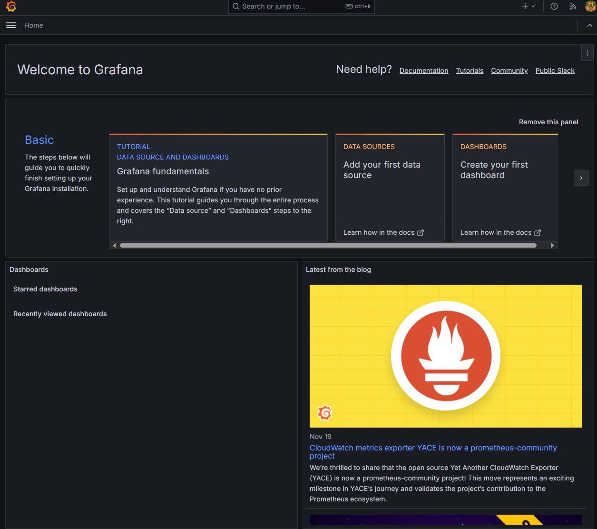


7. **Stop the Grafana container**
    1. Stop the Container:
        ```bash
        docker stop grafana
        ```
    2. Remove the Container:
        ```bash
        docker rm grafana
        ```


# Section 3: Proemtheus, Features of Grafana, Prometheus Setup on AWS

## What is Prometheus?
- **Prometheus** is an open-source **time-series database** and monitoring tool developed by SoundCloud. It is widely used for monitoring, alerting, and gathering metrics for systems and applications.


## Key Features of Prometheus:
1. **Time-Series Data Storage**:
    - Stores metrics in a time-series format, indexed by time and labels.
2. **Powerful Query Language (PromQL)**:
    - A built-in query language for querying and analyzing metrics.
3. **Pull-Based Model:**
    - Pulls metrics from target endpoints at specified intervals, making it secure and flexible.
4. **Service Discovery:**
    - Dynamically discovers services to monitor using Kubernetes, AWS, or static configurations.
5. **Multi-Dimensional Data:**
    - Labels provide a powerful way to slice and dice metrics for detailed analysis.
6. **Alerting:**
    - Comes with a built-in Alertmanager to send alerts via email, Slack, PagerDuty, etc.
7. **Integration with Grafana:**
    - Integrates seamlessly with Grafana for enhanced visualization.
8.  **Efficient Data Storage:**
    - Optimized for high performance and scalable data storage.


## 1. Setting up EC2 Instance

1. Navigate to AWS and "Launch Instance":
    - Go to the AWS Management Console and click on "Launch instance".
2. Instance Details:
    - Name: tech264-maria-prometheus
    - Image: Select the Amazon Linux 2023 AMI (Amazon Machine Image) or Ubuntu 22.04 AMI
    - Size: Choose the t2.micro instance type (eligible for the free tier).
    - Key Pair: Select or create a key pair named 
    - Security Group: Create a security group  with the following rules:
        - Allow SSH access on port 22.
        - Allow HTTP access on port 3000.
        - Allow 9090 - prometheus port 
3. Launch the Instance:
    - Click "Launch instance" to start your EC2 instance.


## Step 2: Install Prometheus
- Update the package manager and upgrade installed packages.

- For **Amazon Linux:**
    ```bash
    sudo yum update -y
    sudo yum upgrade -y

    ```
- For Ubuntu:
    ```bash
    sudo apt update -y
    sudo apt upgrade -y
    ```
## Step 3: Install Dependencies
- Install wget to download Prometheus and tar to extract files.

- For Amazon Linux:
  ```bash
  sudo yum install wget tar -y
  ```
- For Ubuntu:
    ```bash
    sudo apt install wget tar -y
    ```

## Step 4: Download Prometheus
```bash
wget https://github.com/prometheus/prometheus/releases/download/v2.47.0/prometheus-2.47.0.linux-amd64.tar.gz
```

## Step 5: Extract Prometheus
```bash
tar -xvf prometheus-2.47.0.linux-amd64.tar.gz
cd prometheus-2.47.0.linux-amd64
```

## Step 6: Move Prometheus Files
- Move Prometheus binaries and set up directories for Prometheus.
    ```bash
    sudo mv prometheus /usr/local/bin/
    sudo mv promtool /usr/local/bin/
    sudo mkdir -p /etc/prometheus
    sudo mkdir -p /var/lib/prometheus
    sudo mv prometheus.yml /etc/prometheus/
    ```

## Step 7: Create Prometheus User
- Run Prometheus as a dedicated user.
    ```bash
    sudo useradd --no-create-home --shell /bin/false prometheus
    sudo chown -R prometheus:prometheus /etc/prometheus /var/lib/prometheus
    sudo chown prometheus:prometheus /usr/local/bin/prometheus /usr/local/bin/promtool
    ```

## Step 8: Create a Systemd Service File
- Create a systemd service file to manage Prometheus.
    ```bash
    sudo nano /etc/systemd/system/prometheus.service
    ```
- Add the following content:
    ```plaintext
    [Unit]
    Description=Prometheus
    Wants=network-online.target
    After=network-online.target

    [Service]
    User=prometheus
    Group=prometheus
    Type=simple
    ExecStart=/usr/local/bin/prometheus \
    --config.file=/etc/prometheus/prometheus.yml \
    --storage.tsdb.path=/var/lib/prometheus/ \
    --web.console.templates=/usr/local/bin/consoles \
    --web.console.libraries=/usr/local/bin/console_libraries

    [Install]
    WantedBy=multi-user.target

    ```

## Step 9: Start and Enable Prometheus
- Start Prometheus and enable it to run on system boot.
    ```bash
    sudo systemctl daemon-reload
    sudo systemctl start prometheus
    sudo systemctl enable prometheus
    ```

## Step 10: Verify Prometheus is Running
- Check the status of the Prometheus service:
    ```bash
    sudo systemctl status prometheus
    ```


## Step 11: Access Prometheus UI
1. Get the public IP address of your EC2 instance.
2. Open your web browser and go to:
   ```bash
   http://<your-ec2-instance-ip>:9090
   ```
3. You should see the Prometheus web interface.


    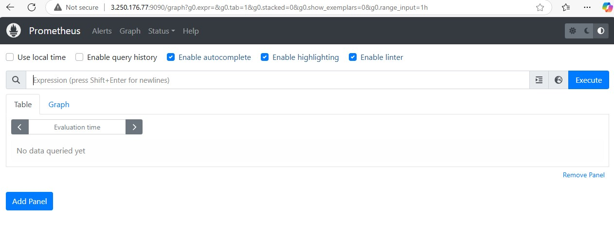


## Configure Prometheus as a Data Source in Grafana

1. **Log In to Grafana**

    - Use the URL http://<EC2_INSTANCE_IP>:3000 and log in with your Grafana credentials.
2. Add Prometheus as a Data Source
    - Navigate to **Configuration > Data Sources**.
    - Click on **Add data source**.
    - Select **Prometheus**.
    - In the **HTTP** section:
        - URL: http://<EC2_INSTANCE_IP>:9090
    - Click **Save & Test**.
    - You should see a success message if the connection is configured correctly.


## Create a Dashboard in Grafana
1. **Create a New Dashboard**

    - Click + Create > Dashboard.
    - Click Add a new panel.
2. **Add a Query**

    - Select Prometheus as the data source.
    - Write a PromQL query, such as
        ```plaintext
        node_cpu_seconds_total
        ```
    - You can refine the query further to get specific metrics.
  
3. **Customize Visualization**

    - Choose a visualization type (e.g., Graph, Gauge, Table).
    - Adjust display settings as needed.


4. Save the Dashboard
    - Click Save and give the dashboard a name.


# Metric Storage Tools
- Influxdb
- Splunk
- AWS
- Prometheus


# Section 4: Grafana oss setup as a service on AWS, User and access provisioning 


## Implementing Grafanma as a Service
### Install Grafana as a Standalone Binary
Source: https://grafana.com/grafana/download
- Version: 9.3.15
- Edition: Enterprise.
### Make sure Grafana binary is available
- SSH into instance 
- Switch to root user: 
    ```bash
    sudo su -
    ```
- Create a directory for Grafana: 
    ```bash
    mkdir /opt/grafana
    ```
- Navigate to the directory: 
    ```bash 
    cd /opy/frafana
    ```
- Download the Grafana binary:
    ```bash
    wget https://dl.grafana.com/enterprise/release/grafana-enterprise-9.3.15.linux-amd64.tar.gz
    ```

### Extract and Start Grafana
- Now we have Grafana binary available.
- Extract the downloaded binary:
    ```bash
    tar -xvzf grafana-enterprise-9.3.15.linux-amd64.tar.gz
    ```
- List the contents to verify: ls -al

    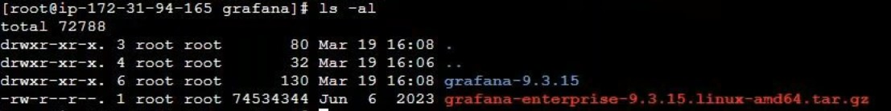


### Check for Grafana Server Utility
- Check if it has a Grafana Server utility
  - Navigate to the Grafana directory: `cd grafana-9.3.15/`
  - List the contents: `ls`

    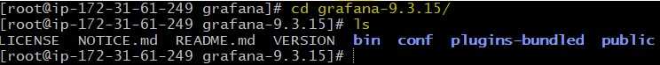

- Navigate to the bin directory: 
    ```bash
    cd bin
    ```
- list the contents to ensure the server utility is present: `ls`

    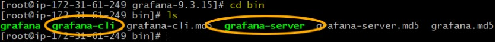


### Create a Service for Grafana
- Open the systemd directory: 
    ```bash
    cd /etc/systemd/system
    ```
- Create and edit the service file: 
    ```bash
    vi grafana-server.service
    ```

#### Service File Content
Add the following content to the service file:
```plaintext
[Unit]
Description=Grafana
Documentation=http://docs.grafana.org
Wants=network-online.target
After=netwrok-online.target

[Service]
User=root
type=simple
WorkingDirectory=/opt/grafana/grafana-9.3.15
ExecStart=/opt/grafana/grafana-9.3.15/bin/grafana-server web

[Install]
WantedBy=multi-user.target
```

#### How to Navigate Controls Using 'vi' (vim)
- Enter Insert Mode: `i` to make changes.
- Exit Insert Mode: Press `Esc`.
- Save and Exit: Type `:wq` and press `Enter`.


### Enable and Start Grafana Service
- Reload Systemd Daemon: 
    ```bash
    systemctl daemon-reload
    ```
- Enable Grafana Service: 
    ```bash
    systemctl enable grafana-server.service
    ```
- Start the service: 
    ```bash
    systemctl start grafana-server.service
    ```

- Check status: 
    ```bash
    systemctl status grafana-server.service
    ```
    
    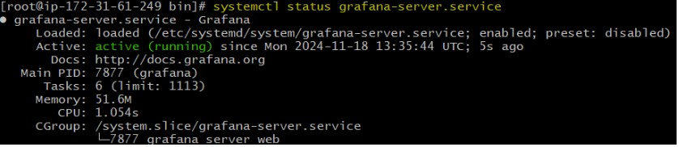

Enable Sigv4 authentication through built in AWS-SDK in Grafana
- `systemctl daemon-reload`
- `AWS_SDK_LOAD_CONFIG=true`
- `GF_AUTH_SIGV4_AUTH_ENABLED=true`

### Access Grafana
You should now be able to access Grafana.
- Take the public IP from your instance.
- And add :3000 onto the end in a web browser.
- To login: admin, admin
  - Then choose a password if you'd like or click "skip".


### User Congifuration
- In the bottom left corner of Grafana, click on "Configuration" > "Teams".
- This is where you can add users/ group multiple users.

    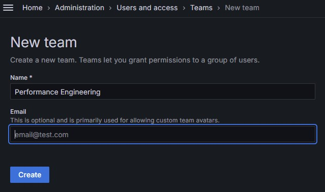

- Where you are logged in as "admin", you will have elevated permissions.


# Section 5 : Workspace, CloudWatch Integration and User administration 
## Grafana Workspace Setup
A workspace in Grafana refers to the setup and configuration environment where users, teams, and dashboards are managed.


## Steps to Set Up a Workspace
### Install Grafana
- Download and install Grafana on your preferred operating system (Windows/Linux). Follow the installation instructions on Grafana’s official website.
- Default port: 3000    
    - Ensure it’s open in the firewall/security group.

### Log In
- Open Grafana in a browser (http://:3000).
- Default credentials
    - Username: admin
    - Password: admin (you will be prompted to change it).

### Create Teams
- Go to **Configuration → Teams**.
- Click "New Team"
    - Example: Create a team called Performance Engineering for grouping relevant users.

### User Roles
- Roles control access levels
    - **Admin**: Full control over the workspace.
    - **Editor**: Can edit dashboards but not administrative settings.
    - **Viewer**: Read-only access.
- To add users, go to Configuration → Users → Invite Users.

### Organisations (Optional for Larger Projects)
- Organisations allow separate environments for different teams/projects.
- Go to **Configuration** → **Server Admi**n → **Organisations** to create one.
Example: Create an organisation for "DevOps" and another for "Data Science."


## CloudWatch Integration
CloudWatch is Amazon's monitoring service that tracks AWS resources. Grafana integrates with CloudWatch to visualise this data.

## Setting Up Grafana with AWS CloudWatch Integration

### **Step 1: Create an IAM User**

1. Log in to the **AWS Management Console**.
2. Navigate to the **IAM (Identity and Access Management)** service.
3. Click on **Users** → **Add user**.
4. Enter a username (e.g., `grafana-cloudwatch-user`).
5. Select **Programmatic access** to generate an Access Key and Secret Key.
6. Click **Next: Permissions**.

#### **Attach Policies**

1. Attach the **CloudWatchReadOnlyAccess** policy to the user.
2. Click **Next: Tags** (optional) and then **Next: Review**.
3. Click **Create user**.
4. Note down the **Access Key** and **Secret Key** for this user. These will be used in Grafana.

---

### **Step 2: Set Up the Data Source in Grafana**

1. Log in to **Grafana**.
2. Navigate to **Configuration → Data Sources → Add Data Source**.
3. Select **CloudWatch** from the list.
4. Enter the following details:
   - **Access Key:** Your AWS IAM Access Key.
   - **Secret Key:** Your AWS IAM Secret Key.
   - **Region:** The AWS region where your CloudWatch data resides.
5. Click **Save and test** to verify the connection.

---

### **Step 3: Create a Dashboard**

1. Navigate to **Dashboards → New Dashboard → Add a Query**.
2. Select **CloudWatch** as the data source.
3. Configure the query by selecting the desired metrics (e.g., **CPU Utilisation**, **Disk I/O**).
4. Customize the visualization as per your requirements.
5. Save the dashboard.

---

## **Notes**

- Ensure that the IAM user only has the required permissions to access CloudWatch metrics.
- Keep the Access Key and Secret Key confidential to avoid unauthorized access.
- Use Grafana's visualization tools to create meaningful and interactive dashboards.

## Workspace Handling in Grafana

Grafana workspaces help manage dashboards, alerts, and user access effectively for improved organization and collaboration.

---

## **Key Tasks for Managing Workspaces**

### **1. Dashboard Creation**
1. Navigate to **Dashboards → New Dashboard**.
2. Use the **Add a Panel** option to visualize metrics from your data source.
3. Configure panel queries and visualizations.
4. Save your dashboard with an appropriate name.

---

### **2. Folders**
- Group dashboards into folders for better organization.
1. Navigate to **Dashboards → Manage**.
2. Click **New Folder** to create a folder.
3. Move dashboards into folders as needed.

---

### **3. Alerts**
- Alerts notify users when metrics meet specific thresholds.
1. Configure alerts directly in panels:
   - Example: Set an alert for **CPU usage > 80%**.
2. Navigate to the **Alert** tab in the panel settings.
3. Define thresholds, conditions, and notification channels.
4. Save the alert.

---

### **4. Team Collaboration**
- Use **Teams** to assign dashboards and alerts to specific groups.
1. Go to **Configuration → Teams**.
2. Create a team (e.g., "DevOps Team").
3. Assign users to the team.
4. Restrict access to dashboards by team:
   - Example: Allow only the "DevOps Team" to access infrastructure-related dashboards.

---

## **Access Controls in Grafana**

Grafana provides robust access control features to ensure data security and facilitate collaboration.

### **1. Roles**
- Roles define user permissions and are assigned per user or team:
  - **Admin:** Full access to manage users, dashboards, and settings.
  - **Editor:** Can edit dashboards but cannot manage users or access settings.
  - **Viewer:** Can view dashboards but cannot make any changes.

---

### **2. Permissions**
- Permissions can be applied at:
  - **Folder Level:** Restrict access to a set of dashboards within a folder.
  - **Dashboard Level:** Limit access to specific dashboards.
1. Navigate to **Dashboards → Permissions** to configure.
2. Assign permissions by role or user.

---

### **3. Invite Users**
- Invite new users to Grafana:
1. Go to **Configuration → Users → Invite Users**.
2. Enter the user's email address.
3. Assign a role (Admin, Editor, Viewer).

---

## **Optional: SMTP Configuration for Invitations and Alerts**
To enable email-based invitations and alerts, configure SMTP in Grafana.

### **Steps to Enable SMTP**
1. Edit the `grafana.ini` file.
2. Locate the `[smtp]` section and enable SMTP:
   ```ini
   [smtp]
   enabled = true
   host = smtp.gmail.com:587
   user = your-email@gmail.com
   password = your-email-password
   from_address = your-email@gmail.com
   from_name = Grafana


# Section 6: Prometheus setup as a service, Grafana SMTP replay configuration 

[prometheus-as-service](prometheus-as-a-service.md)


## USEFULL DOCUMENTATION : https://www.linode.com/docs/guides/how-to-install-prometheus-and-grafana-on-ubuntu/


# How to Install and Configure Node Exporter on the Client

- Before a remote system can be monitored, it must have some type of client to collect the statistics. Several third-party clients are available. However, for ease of use, Prometheus recommends the Node Exporter client. After Node Exporter is installed on a client, the client can be added to the list of servers to scrape in `prometheus.yml`.

## To install Node Exporter
**Note**  
When Node Exporter is running, its collection of statistics is available on port **9100**. This port is accessible on the internet, and anyone running Prometheus elsewhere can potentially collect them. If you are using a firewall, you must open port **9100** using the command:

```bash
sudo ufw allow 9100
```

1. Consult the Node Exporter section: https://prometheus.io/download/#node_exporter  of the Prometheus downloads page and determine the latest release.
2. Use `wget` to download this release
    ```bash
    wget https://github.com/prometheus/node_exporter/releases/download/v1.5.0/node_exporter-1.5.0.linux-amd64.tar.gz
    ```
3. Extract the application.
    ```bash
    tar xvfz node_exporter-*.tar.gz
    ```
4. Move the executable to usr/local/bin so it is accessible throughout the system.
    ```bash
    sudo mv node_exporter-1.5.0.linux-amd64/node_exporter /usr/local/bin
    ```
5. **(Optional)** Remove any remaining files.
    ```bash
    rm -r node_exporter-1.5.0.linux-amd64*
    ```

6. There are two ways of running Node Exporter. It can be launched from the terminal using the command `node_exporter`. Or, it can be activated as a system service. Running it from the terminal is less convenient. But this might not be a problem if the tool is only intended for occasional use. To run Node Exporter manually, use the following command. The terminal outputs details regarding the statistics collection process.
    ```bash
    node_exporter
    ```

7. It is more convenient to run Node Exporter as a service. To run Node Exporter this way, first, create a `node_exporter user`.
   ```bash
   sudo useradd -rs /bin/false node_exporter
   ```

8. Create a service file for `systemctl` to use. The file must be named `node_exporter.service` and should have the following format. Most of the fields are similar to those found in `prometheus.service`, as described in the previous section.
    ```bash
    sudo vi /etc/systemd/system/node_exporter.service
    ```
    ```ini
    [Unit]
    Description=Node Exporter
    Wants=network-online.target
    After=network-online.target

    [Service]
    User=node_exporter
    Group=node_exporter
    Type=simple
    Restart=on-failure
    RestartSec=5s
    ExecStart=/usr/local/bin/node_exporter

    [Install]
    WantedBy=multi-user.target
    ```

9. **(Optional)** If you intend to monitor the client on an ongoing basis, use the `systemctl enable` command to automatically launch Node Exporter at boot time. This continually exposes the system metrics on port `9100`. If Node Exporter is only intended for occasional use, do not use the command below.
    ```bash
    sudo systemctl enable node_exporter
    ```
10. Reload the `systemctl` daemon, start Node Exporter, and verify its status. The service should be `active`.
    ```bash
    sudo systemctl daemon-reload
    sudo systemctl start node_exporter
    sudo systemctl status node_exporter 
    ```

11. Use a web browser to visit port `9100` on the client node, for example, `http://local_ip_addr:9100`. A page entitled `Node Exporter` is displayed along with a link reading `Metrics`. Click the `Metrics` link and confirm the statistics are being collected. For a detailed explanation of the various statistics, see the Node Exporter Documentation. https://prometheus.io/docs/guides/node-exporter/


## Second Option 
1. 
    ```
    sudo su -
    ```
2. 
    ```
    mkdir /opt/node-exporter
    ```
3. 
    ```
    cp /opt/node-exporter/
    ```
4. 
    ```
    wget https://github.com/prometheus/node_exporter/releases/download/v1.0.1/node_exporter-1.0.1.linux-amd64.tar.gz
    ```
5. 
    ```
    tar xzf node_exporter-1.0.1.linux-amd64.tar.gz
    ```
6. 
    ```
    cp node_exporter-1.0.1.linux-amd64/node_exporter /usr/local/bin/node_exporter
    ```
7. 
    ```
    vi /etc/systemd/system/node-exporter.service
    ```

8. 
    ```plaintext
    [Unit]
    Description=Prometheus Node Exporter Service
    After=network.target

    [Service]
    User=root
    Type=simple
    ExecStart=/usr/local/bin/node_exporter

    [Install]
    WantedBy=multi-user.target

    ```

9. 
    ```
    rm -rf node_exporter-1.0.1.linux-amd64.tar.gz node_exporter-1.0.1.linux-amd64
    ```

10. 
    ```
    systemctl daemon-reload
    ```

11. 
    ```
    systemctl enable node-exporter
    ```
12. 
    ```
    systemctl start node-exporter
    ```
13. 
    ```
    systemctl status node-exporter
    ```

On the prometheus instance :
- `SSH` into 
- `cd /etc/prometheus` 
- `ls` 
-  `nano prometheus.yml` 
-
    ```
    global:
    scrape_interval: 10s

    scrape_configs:
    - job_name: 'prometheus'
        scrape_interval: 5s
        static_configs:
        - targets: ['localhost:9090']

    - job_name: 'grafana-node'
        scrape_interval: 5s
        static_configs:
        - targets: ['3.83.69.49:9100']
    ```
- `systemctl restart prometheus.service`
- `systemctl status prometheus.service`


# How to Configure Prometheus to Monitor Client Nodes
The client nodes are now ready for monitoring. To add clients to `prometheus.yml`, follow the steps below:

1. On the monitoring server running Prometheus, open `prometheus.yml` for editing.
    ```bash
    sudo vi /etc/prometheus/prometheus.yml
    ```
2. Locate the section entitled `scrape_configs`, which contains a list of jobs. It currently lists a single job named `prometheus`. This job monitors the local Prometheus task on port `9090`. Beneath the `prometheus` job, add a second job having the `job_name` of `remote_collector`. Include the following information.
   - A `scrape_interval` of `10s`.
   - Inside `static_configs` in the `targets` attribute, add a bracketed list of the IP addresses to monitor. Separate each entry using a comma.
   - Append the port number `:9100` to each IP address.
   - To enable monitoring of the local server, add an entry for `localhost:9100` to the list.
   ```bash
   # File: /etc/prometheus/prometheus.yml
   ...
   - job_name: "remote_collector"
     scrape_interval: 10s
     static_configs:
       - targets: ["remote_addr:9100"]
   ```

3. To immediately refresh Prometheus, restart the `prometheus` service.
    ```bash
    sudo systemctl restart prometheus
    ```

4. Using a web browser, revisit the Prometheus web portal at port `9090` on the monitoring server. Select **Status** and then **Targets**. A second link for the `remote_collector` job is displayed, leading to port `9100` on the client. Click the link to review the statistics.

    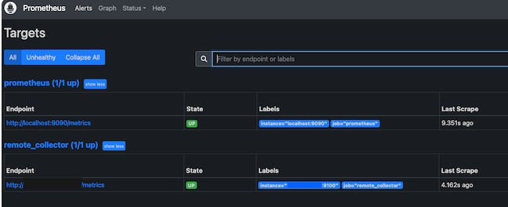


# How to Integrate Grafana and Prometheus
All system components are now installed, but Grafana and Prometheus are not set up to interact. The remaining configuration tasks, including adding Prometheus as the data source and importing a dashboard panel, can be accomplished using the Grafana web interface.

1. Using a web browser, visit port `3000` of the monitoring server. For example, enter `http://local_ip_addr:3000`, replacing `local_ip_addr` with the actual IP address. Grafana displays the login page. Use the user name `admin` and the default password `password`. Change the password to a more secure value when prompted to do so.

    

2. After a successful password change, Grafana displays the Grafana Dashboard.

    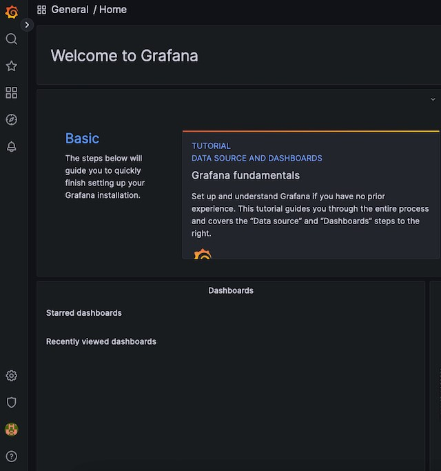

3. To add Prometheus as a data source, click the gear symbol, standing for **Configuration**, then select **Data Sources**.

    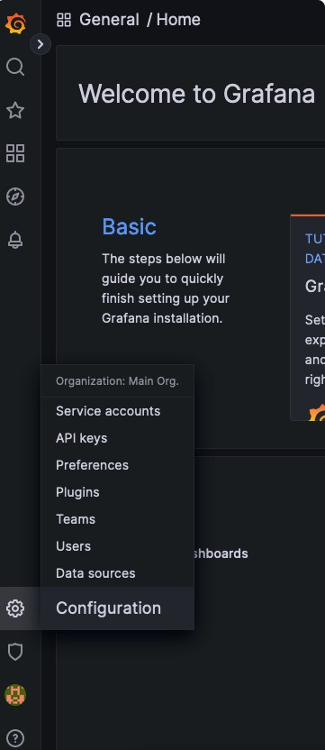

4. At the next display, click the **Add data source** button.

    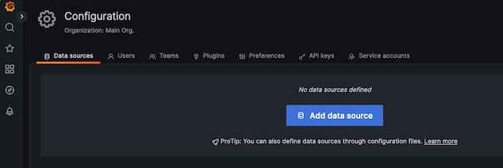
    

5. Choose **Prometheus** as the data source.

    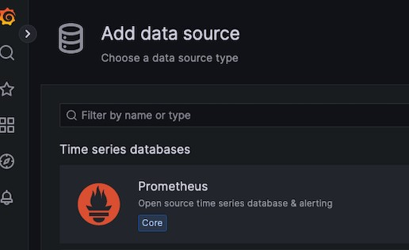

6. For a local Prometheus source, set the URL to `http://localhost:9090`. Most of the other settings can remain at the default values. However, a non-default `Timeout` value can be added here.

    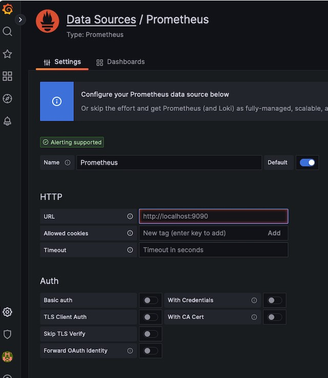

7. When satisfied with the settings, select the **Save & test** button at the bottom of the screen.


    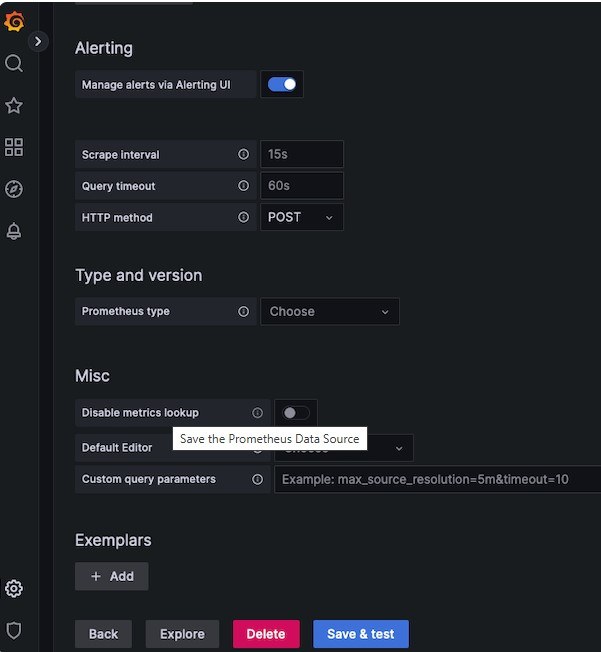

8. If all settings are correct, Grafana confirms the `Data source` is working.


    [alt text](data-source.jpg)


# How to Import a Grafana Dashboard
1. Visit the Grafana Dashboard Library : https://grafana.com/grafana/dashboards/ . Enter `Node exporter` as the search term.

    


2. Select the entry for `Node Exporter Full`.

    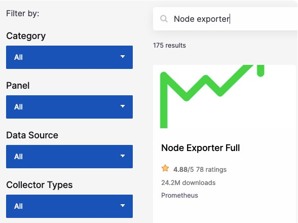

3. Make a note of the ID number or use the button to copy the ID to the clipboard. The ID of this board is currently `1860`.

    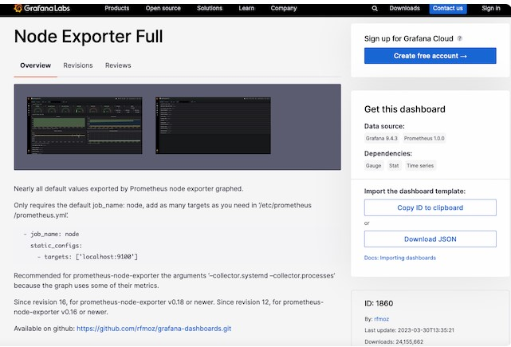

4. Return to the Grafana dashboard. Select the **Dashboard** icon, consisting of four squares, and choose + **Import**.

    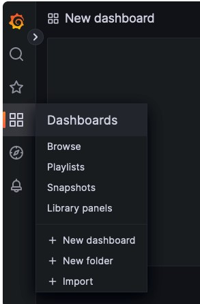

5. In the **Import via grafana.com** box, enter the ID `1860` from the previous step. Then select the **Load** button.

    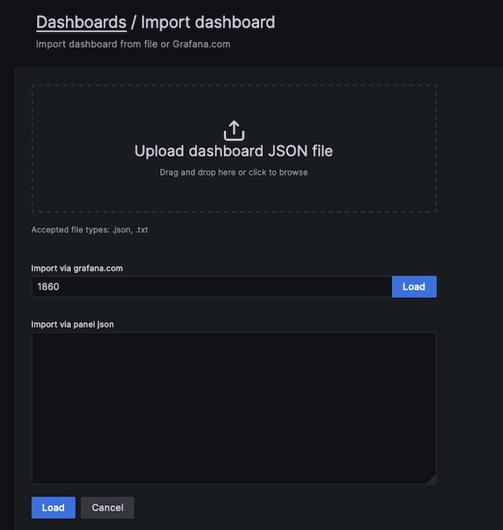

6. At the next screen, confirm the import details. Choose `Prometheus` as the data source and click the **Import** button.

    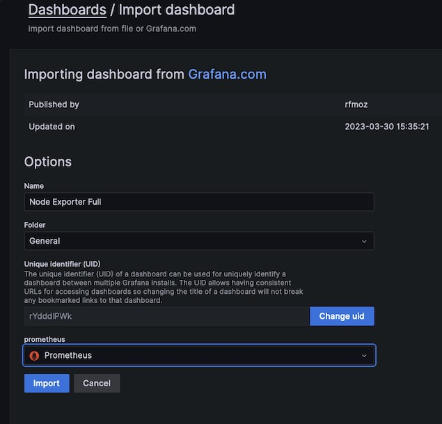

7. The `Node Exporter Full` dashboard takes effect immediately. It displays the performance metrics and state of the client node, including the Memory, RAM, and CPU details. Several drop-down menus at the top of the screen allow users to select the host to observe and the time period to highlight.

    The following example demonstrates how a client reacts when stressed by a demanding Python program. The **CPU Busy** widget indicates how the CPU is pinned near the maximum. If this occurs during normal operating conditions, it potentially indicates more CPU power is required.

    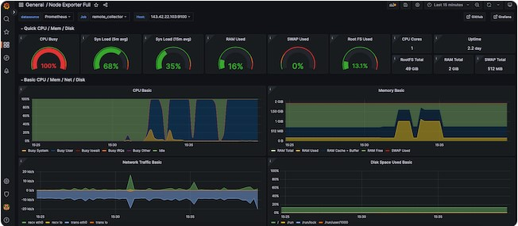