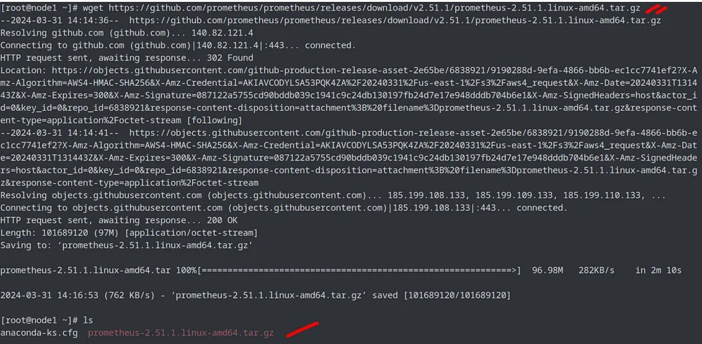
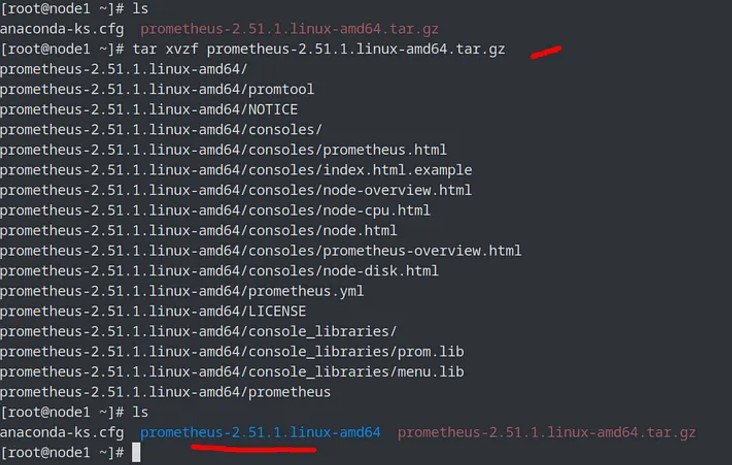

# Prometheus Setup as a Service

## Create an EC2 Instance with Prometheus Installed
- Set up an EC2 instance using Ubuntu.
- Ensure the security group allows:
  - SSH
  - HTTP
  - 9090 (Prometheus uses this port).

- Update and Upgrade:
    ```bash
    sudo apt-get update
    ```
    ```bash
    sudo DEBIAN_FRONTEND=noninteractive apt-get upgrade -y
    ```


## Install Prometheus and Prometheus Node Exporter and Configure the YAML file
1. Insert the following command: 
    ```bash
    sudo apt-get install prometheus prometheus-node-exporter -y
    ```
2. Edit the Prometheus config file: 
    ```
    sudo nano /etc/prometheus/prometheus.yml.
    ```
    - You can change 'localhost' with the public IP of the instance you want to connect.

3. Add or modify the scrape targets IF necessary.
    ```yaml
    global:
    scrape_interval: 15s

    scrape_configs:
    - job_name: "prometheus"
        static_configs:
        - targets: ["localhost:9090"]

    ```

## Start, enable and access the Prometheus UI

1. Start Prometheus using: `sudo systemctl start prometheus`.
2. Enable it using: `sudo systemctl enable prometheus`.
3. Access it using your EC2's public IP with a port of `9090`.


## Install Docker

###  Step 1: Update Package List

```bash
sudo apt-get update
```
### Step 2: Install Docker
```
sudo apt-get install docker.io
```
### Step 3: Start Docker Service
```
sudo systemctl start docker
```
### Step 4: Check Docker Status
```
sudo systemctl status docker
```
### Step 5: Enable Docker to Start at Boot
```
sudo systemctl enable docker
```
### Step 6: Add Your User to the Docker Group
To avoid using sudo for Docker commands, add your user to the Docker group:
```
sudo usermod -aG docker $USER
```
#### Note:
- This stops the need to use sudo with Docker commands, reducing security risks of granting Docker root privileges.


### Step 7: Log Out and Log Back In
- You must log out and log back in for the group changes to take effect.

### Step 8: Pull the Grafana Docker Image
```
sudo docker pull grafana/grafana-enterprise
```

### Step 9: Run the Grafana Container
```
sudo docker run -d -p 3000:3000 --name=grafana grafana/grafana-enterprise
```

### Access Grafana:
- Open your browser and go to: http://<your-server-ip>:3000
- Default credentials
    - **Username**: `admin`
    - **Password**: `admin`


## Adding a Data Source in Grafana

### Step 1: Navigate to Grafana
1. Open your browser and navigate to the following URL using the **Public IP** of your EC2 instance: http://<ec2-ip>:3000/


### Step 2: Access Data Source Settings
1. In Grafana, go to:
- **Configuration** → **Data Sources**.

### Step 3: Add a New Data Source
1. Select **Add data source**.
2. From the list, search for and select **Prometheus**.

### Step 4: Configure the Data Source
1. Name the data source (choose any name you prefer).
2. Edit the connection settings to use the **Public IP** of your EC2 instance where Prometheus is installed:
- **URL**: `http://<ec2-ip>:9090/`

### Step 5: Save and Test
1. Click **Save & test**.
2. Grafana will validate the connection and prompt you to start building a dashboard.

### Step 6: Verify the Data Source
1. Go back to **Configuration** → **Data Sources**.
2. You should now see **Prometheus** listed as a configured data source.


# Prometheus Setup as a Service

- Prometheus is service-based monitoring tool means it was designed to monitor and manage services and applications

## Step 1: Install Prometheus
1. Download Prometheus:
    - The first step is to download the Prometheus package from the GitHub page to get the latest version.
  
        


    
    - Use wget or curl to download the tarball
        ```bash
        wget https://github.com/prometheus/prometheus/releases/download/v2.51.1/prometheus-2.51.1.linux-amd64.tar.gz
        ```
        


2. Extract the Tarball

    ```bash
    tar -xvzf prometheus-2.51.1.linux-amd64.tar.gz
    ```

    

3. **Optional** remove the tarball after the extraction if you want

    ```bash
    rm -rf prometheus-2.51.1.linux-amd64.tar.gz
    ```
4. Create two new directories for Prometheus to use. The `/etc/prometheus` directory stores the Prometheus configuration files. The `/var/lib/prometheus` directory holds application data.
    ```bash
    sudo mkdir /etc/prometheus
    sudo mkdir /var/lib/prometheus
    ```
    - **or**
    ```bash
    sudo mkdir /etc/prometheus /var/lib/prometheus
    ```
5. Move into the main directory of the extracted `prometheus` folder.
    ```bash
    cd prometheus-2.51.1.linux-amd64.tar.gz
    ```

6. Move the `prometheus` and `promtool` directories to the `/usr/local/bin/` directory. This makes Prometheus accessible to all users.
    ```bash
    sudo mv prometheus /usr/local/bin/
    sudo mv promtool /usr/local/bin/
    ```
    - **or** 
    ```bash
    sudo mv prometheus promtool /usr/local/bin/
    ```
7. Move Configuration and Set Up Directories:
    ```bash
    sudo mv consoles /etc/prometheus/
    sudo mv console_libraries /etc/prometheus/
    sudo mv prometheus.yml /etc/prometheus/
    ```
8. Verify the version

    ```bash
    prometheus --version
    ```
## Step 2: Create a Prometheus User:
- To run Prometheus securely, it's best to create a dedicated user:
    ```bash
    sudo useradd --no-create-home --shell /bin/false prometheus
    ```
- Set permissions for Prometheus directories:
    ```bash
    sudo chown -R prometheus:prometheus /etc/prometheus /var/lib/prometheus
    sudo chown prometheus:prometheus /usr/local/bin/prometheus /usr/local/bin/promtool
    ```

## Step 3: Create a Systemd Service File
- Create a service file for Prometheus:
    ```bash
    sudo nano /etc/systemd/system/prometheus.service
    ```
- Add the following content to the file:
    ```ini
    [Unit]
    Description=Prometheus Monitoring
    Wants=network-online.target
    After=network-online.target

    [Service]
    User=prometheus
    Group=prometheus
    Type=simple
    ExecStart=/usr/local/bin/prometheus \
    --config.file=/etc/prometheus/prometheus.yml \
    --storage.tsdb.path=/var/lib/prometheus/ \
    --web.console.templates=/etc/prometheus/consoles \
    --web.console.libraries=/etc/prometheus/console_libraries

    [Install]
    WantedBy=multi-user.target
    ```
    - the group can be removed 

## Step 4: Reload Systemd and Start Prometheus
1. Reload the systemd daemon:
    ```bash
    sudo systemctl daemon-reload
    ```
2. Start Prometheus:
    ```bash
    sudo systemctl start prometheus
    ```
3. Enable Prometheus to Start on Boot:
    ```bash
    sudo systemctl enable prometheus
    ```

## Step 5: Verify Prometheus Setup
1. Check Service Status:
    ```bash
    sudo systemctl status prometheus
    ```

2. Access Prometheus in a Browser:
   - By default, Prometheus runs on port 9090.
   - Open a browser and navigate to: http://<your-server-ip>:9090.